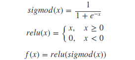

>>>>>>> HEAD

# ACSCP crowd counting model
=======
[](LICENSE)
## Introduction
This is open source project for crowd counting. Implement with paper "Crowd Counting via Adversarial Cross-Scale Consistency Pursuit" from Shanghai Jiao Tong University.  For more details, please refer to our [Baidu Yun](https://pan.baidu.com/s/1mjPpKqG)

<p align="center">

</p>
<p align="center">

</p>
<p align="center">

</p>
<p align="center">

</p>
<p align="center">

</p>
<p align="center">

</p>
<p align="center">

</p>
<p align="center">

</p>
<p align="center">

</p>
<p align="center">

</p>

### Contents
1. [Installation](#installation)
2. [Preparation](#preparation)
3. [Train/Eval/Release](#trainevalrelease)
4. [Additional](#addtional)
5. [Details](#details)

### Installation
1. Configuration requirements

```
python3.x

Please using GPU, suggestion more than GTX960

python-opencv
#tensorflow-gpu==1.0.0
#tensorflow==1.0.0
scipy==1.0.1
matplotlib==2.2.2
numpy==1.14.2

conda install -c https://conda.binstar.org/menpo opencv3
pip install -r requirements.txt
```

2. Get the code

```
git clone git@github.com:Ling-Bao/ACSCP_cGAN.git
cd ACSCP_cGAN
```

### Preparation
1. ShanghaiTech Dataset. 
ShanghaiTech Dataset makes by Zhang Y, Zhou D, Chen S, et al. For more detail, please refer to paper "Single-Image Crowd Counting via Multi-Column Convolutional Neural Network" and click on [here](https://www.cv-foundation.org/openaccess/content_cvpr_2016/papers/Zhang_Single-Image_Crowd_Counting_CVPR_2016_paper.pdf).

2. Get dataset and its corresponding map label
[Baidu Yun](https://pan.baidu.com/s/1gccvnvIeLgQZCVuA6iZEjA) 
Password: yvs1

3. Unzip dataset to ACSCP_cGAN root directory

```
unzip Data.zip
```

### Train/Eval/Release
Train is easy, just using following step.

1. Train. Using [main.py](main.py) to evalute crowd counting model

```
python main.py --phase train
```

2. Eval. Using [main.py](main.py) to evalute crowd counting model

```
python main.py --phase test

OR

python main.py --phase inference
```

### Addtional
1. Crowd map generation tools
Source code store in "data_maker", detail please check [here](data_maker/README.md).
**Note: **This tools write by matlab, please install matlab.

2. Model release
 Model release. Using [product.py](product.py) to release crowd counting model. Download release version 0.1.0, please click on [here](release/version1.0.0.tar.gz)
 
 3. Results
<ul align="center">

<p align="center">Original image</p>

<p align="center">Real crowd map, counting is 707</p>

<p align="center">Predict crowd map, counting is 698</p>
</ul>

### Details
1. Tring to delete dropout layers.

2. Improving activation funtion for last layer to adapt crowd counting map estimation.
<p align="center">

</p>

=======
[](LICENSE)
>>>>>>> TAIL
